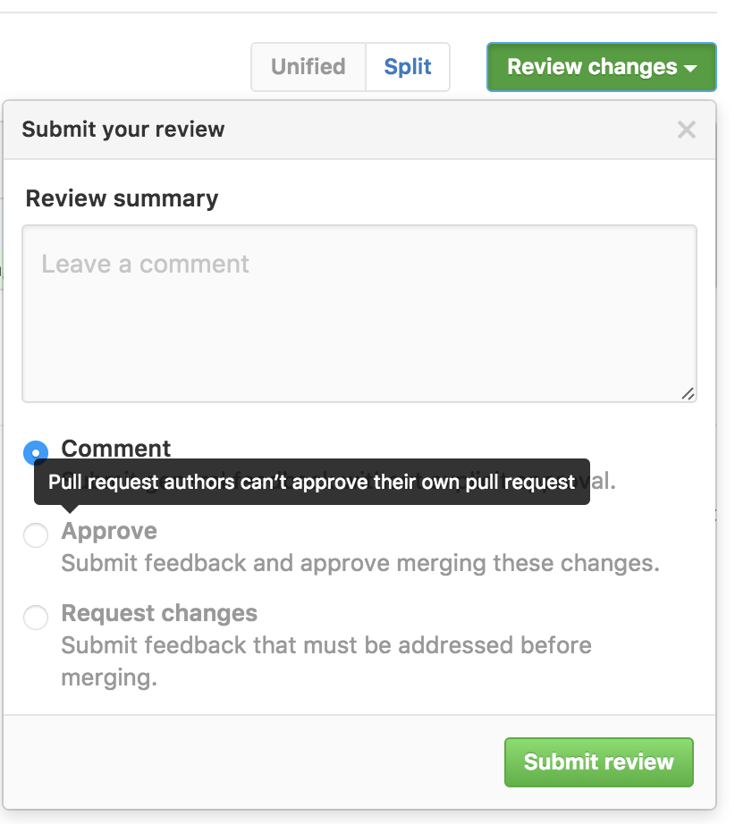

*Update: I want to keep the original post intact, but I'll post any feature
updates that GitHub makes here as they are released.*

- *You can now [dismiss a review](https://github.com/blog/2265-dismissing-reviews-on-pull-requests).*

---

GitHub
[recently](https://github.com/blog/2256-a-whole-new-github-universe-announcing-new-tools-forums-and-features) rolled
out a new feature on their pull requests called "Reviews". The feature is (in
theory), something that I've
been
[asking for](https://groups.google.com/d/msg/sympy/KJwDwT_P6Lw/27ha6ipuBwAJ).
However, it really falls short in a big way, and I wanted to write down my
gripes with it, in the hopes that it spurs someone at GitHub to fix it.

If you don't know, GitHub has had, for some time, a feature called "pull
requests" ("PRs"), which lets you quite nicely show the diff and commit
differences between two branches before merging them. People can comment on
pull requests, or on individual lines in the diff. Once an administrator feels
that the pull request is "ready", they can click a button and have the branch
automatically merged.

The concept seems super simple
in [retrospect](https://en.wikipedia.org/wiki/Hindsight_bias), but this
feature completely revolutionized open source software development. It really
is the bread and butter of GitHub. I would argue that this one single feature
has made GitHub the (*the*) primary hosting site for open source software.

Aside from being an awesome idea, GitHub's trademark with pull requests, along
with their other features, has been absolute simplicity in implementation.
GitHub Reviews marks, by my estimation, the first major feature released by
GitHub that completely and utterly lacks in this execution of simplicity.

Let's look at what Reviews is. When the feature first came out, I had a hard
time figuring out how it even worked (the
poor
[release date docs](https://twitter.com/asmeurer/status/776125249712717824)
didn't help here either).

Basically, at the bottom of a pull request, you now see this

Clicking the "Add your review" button takes you to the diff page (first gripe:
why does it move you to the diff page?), and opens this dialog

"OK", you might think, "this is simple enough. A review is just a special
comment box where I can approve or reject a pull request." (This is basically
the feature that I've been wanting, the ability to approve or reject pull
requests.) And if you thought that, you'd be wrong.

The simplest way I can describe a review, having played with it, is that it is
a distinct method of commenting on pull requests and on lines of diffs of pull
requests. Distinct, that is, from the methods that **already exist** in the
GitHub pull requests feature. That's right. There are now two ways to comment
on a pull request (or on a line in a pull request). There's the old way, which
involves typing text into the box at the bottom of the main pull request page
(or on a line, and then pressing "Add a single comment"), and the new way,
which involves clicking a special button at the top of the diff view (and the
diff view only) (or by clicking a line in the diff and
clicking "Start a review").

How do these two ways of the extremely simple task of commenting differ from
one another? Two ways. One, with the old way, when you comment on a PR (or
line), the comment is made immediately. It's saved instantly to the GitHub
database, and a notification email is sent to everyone subscribed to the PR.
With the new way, the comment is **not** made immediately.  Instead, you start
a "review", which postpones all comments from being published until you scroll
to the top and press a button ("Review changes"). **Did you forget to scroll
to the top and press that button? Oh well, your comments never got sent to
anyone.**

Now, I've been told by some people that delayed commenting is a feature that
they like. I can see how fewer total emails could be nice. **But if you just
want a way to delay comments, why do you need distinct commenting UIs?**
Couldn't the same thing be achieved via a user setting (I highly suspect that
any given person will either like or dislike delayed commenting universally)?
Or with a checkbox next to the comment button, like "delay notifications for
this comment"? You can probably guess by now which of the two commenting
systems I prefer. But guess what happens when I press the "Cmd-Enter" keyboard
shortcut that's been hard-wired into my brain to submit a comment? I'll give
you a hint: the
result
[does not make me happy](https://twitter.com/asmeurer/status/781949163562999808).

The second distinction between normal, old-fashioned commenting and the
new-fangled reviews system is that when you finalize a review, you can elect
to "approve" or "reject" the pull request. This approval or rejection gets set
as a special status on the pull request. This status, for me personally, is
the only feature here that I've been wanting. It turns out, however, that it's
completely broken, and useless.

Here's my problem. We have, at the time of
writing, [382 open pull requests](https://github.com/sympy/sympy/pulls) in
SymPy. A lot of these are old, and need to be triaged. But the problem from my
point of view is the new ones. When I look through the list of pull requests,
I want to be able to know, at a glance, which ones are "reviewable". For me,
this means two things

1. The tests pass.

2. No other reviewer (myself included) has already requested changes, which
   still need to be made by the PR author.

Point 1 is really easy to see. In the pull request list, there is a nice green
checkmark if Travis passed and a red X if it failed.

The second point is a disaster. Unfortunately, there's no simple way to do
this. You might suggest adding a special label, like "Needs changes", to pull
requests that have been reviewed. The problem with this is that the label
won't go away when the changes have been made. And to worsen things, people
who don't have push access (in the list above, only two PR authors have push
access, and one of them is me), cannot add or remove labels on pull requests.

Another thing
that
[has been suggested to me](https://twitter.com/asmeurer/status/771393023389339649) is
an external "review" service that sets a status for a review. The problem with
this (aside from the fact that I couldn't find one that actually did the very
simple thing that I wanted), is that you now have to teach all your pull
request reviewers to use this service. You might as well forget about it.

Having a first-class way in GitHub for reviewers to say "I approve these
changes" or "I don't approve these changes" would be a huge boon, because then
everyone would use it.

So great right, this new Reviews feature is exactly what you want, you say.
You can now approve or reject pull requests.

Well no, because GitHub managed to overengineer this feature to the point of
making it useless. This completely simple feature. All they had to do was
extend the status UI and add a simple "I approve/I reject" button. If they did
that, it would have worked perfectly.

Here are the problems. First, the pull request list has no indication of
review status. Guess which pull requests in the above screenshot have reviews
(and which are positive and which are negative). You can't tell (for example,
the last one in the list has a negative review). If they were actually treated
like statuses, like the UI suggests that they would, you would at least see an
X on the ones that have negative reviews (positive reviews I'm much less
worried about; most people who review PRs have merge access, so if they like
the PR they can just merge it). I would suggest to GitHub to add, next to the
status checkbox, a picture of everyone who's made a review on the PR, with a
green checkmark or red X to indicate the type of review. Also, add buttons
(**buttons**, not just buried advanced search options) to filter by reviews.

OK, so that's a minor UI annoyance, but it gets worse. Next on the docket, **you
can't review your own pull requests.** It's not allowed for some reason.

Now why would you want to review your own pull request, you might ask? Aren't
you always going to "approve" your own PR? Well, first off, no. There is such
a thing as
a [WIP PR](http://ben.balter.com/2015/12/08/types-of-pull-requests/). The
author setting a negative review on his own PR would be a great way to
indicate WIP status (especially given the way reviews work, see my next
gripe). Secondly, the "author" of a pull request is just the person who
clicked the "New pull request" button. That's not necessarily the only person
who has changes in the pull request. Thanks to the magic of how git works,
it's quite easy to have a pull request with commits from many people. Multiple
people pushing to a shared branch, with a matching pull request for discussion
(and easy viewing of new commits and diff) is a valid and useful workflow
(it's the only one I know of that works for writing collaborative prose). For
the [SymPy paper](https://github.com/sympy/sympy-paper), I wanted to use
GitHub Reviews to sign off on a common branch, but since I'm the one who
started the pull request, I couldn't do it.

Next gripe, and this, I want to stress, makes the whole feature completely
useless for my needs: **reviews do not reset when new commits are pushed**.
Now, I just outlined above two use-cases where you might want to do a review
that doesn't reset (marking WIP, and marking approval, although the second is
debatable), but both of those can easily be done by other means, like editing
the title of the PR, or old-fashioned commenting. The whole point of Reviews
(especially negative reviews), you'd think, would be to indicate to people
that the pull request, as it currently stands, needs new changes. A negative
review is like failing your "human" test suite.

But unlike your automated test suite, which reset and get a new go every time
you push a change (because hey, who knows, maybe the change ACTUALLY FIXED THE
ISSUE), reviews do not reset, unless the original reviewers explicitly change
them. So my dream of being able to glance at the pull request list and see
which PRs need changes has officially
been [piped](https://en.wiktionary.org/wiki/pipe_dream). Even if the list
actually showed what PRs have been reviewed, it would be a lie, because as
soon as the PR author pushes a change, the review status becomes potentially
outdated.

Now, given the rocky start that this whole feature has had, I figured that
this was probably just a simple bug. But after I reported it to GitHub,
they've informed me that this is in fact *intended behavior*.

To make things worse, GitHub has another feature with Reviews,
called
[required reviews](https://help.github.com/articles/approving-a-pull-request-with-required-reviews/).
You can make it so that every pull request must receive at least one positive
review and zero negative reviews before it can be merged (go to the branch
settings for your repository). This works similar to required status checks,
which make it so that your tests must pass before a PR can be merged. In
practice, this means you need zero negative reviews, since anyone with push
access could just do a positive review before merging (although annoyingly,
you have to actually manually do it; IMHO, just requiring zero negative
reviews should be sufficient, since merging is implicitly a positive review).

Now, you can see that the above "feature" of reviews not resetting breaks the
whole thing. If someone negative reviews a PR, that one person has to go in
and change their review before it can be merged. And even if the author pushes
new changes to fix the issues outlined in the review, the PR cannot be merged
until the reviewer resets it. So this actually makes the reviewing situation
*worse*, because now anyone who reviews a pull request at any point in time
has to go through with it all the way to the merge. I can't go to a PR that
someone requested changes for, which were later made by the author, and merge
it. I have to ping the reviewer and get them to change their review first.
Needless to say, we do not have this feature enabled for SymPy's repo.

I think I maybe see the intended use-case here. You want to make it so that
people's reviews are not forgotten or ignored. But that's completely foreign
to my own problems. I trust the SymPy community, and the people who have push
access to do due diligence before merging a pull request. And if a bad change
gets in, we can revert it. Maybe this feature matters more for projects that
continuously deploy. Likely most of the code internal at GitHub works like
that. But guess what GitHub, most of the code *on* GitHub does *not* work like
that. You need to rethink this feature to support more than just your
use-cases.

I think starting simple, say, just a simple "approve/reject" button on each
PR, which just adds an icon, and that's it, would have been a better approach.
Then they could have listened to the feedback on what sorts of things people
wanted it to be able to do (like setting a status, or showing up in the search
list, or "delayed commenting" if that's really what people want). This is how
GitHub used to do things. It's frustrating to see a feature implemented that
doesn't (yet) do quite what you want, but it's even more frustrating to see a
feature implemented that does all the things that you don't want.

# Summary

Yes, I'm a little mad here. I hope you enjoyed my rant. Here are what I see as
the problems with the "Reviews" feature. I don't know how to fix these
problems (I'm not a UI/UX guy. GitHub supposedly hires them, though).

- There are now two distinct ways to comment on a PR (delayed and non-delayed).
  There should be one (say, with a checkbox to delay commenting).

- If you insist on keeping delayed commenting, let me turn it off by default
  (default = the Cmd-Enter keyboard shortcut).

- The reviews button is buried on the diff page. I would put it under the
  main PR comment box, and just reuse the same comment box.

- Reviews should show up in the pull request list. They should be filterable
  with a nice UI.

- Let me review my own pull requests. These can be excluded from required
  reviews (that makes sense to me). Beyond that, there's no reason this
  shouldn't be allowed.

- Don't require a positive review for required reviews, only zero negative
  reviews. Merging a PR is implicitly positively reviewing it.

- Allow reviews to reset when new commits are pushed.

I get that the last point may not be what everyone wants. But GitHub needs to
think about UI, and defaults here. Right now, the UI looks like reviews are
like statuses, but they actually aren't because of this.

I am dispirited to see GitHub release such a broken feature, but even the best
trip up sometimes. I'm not yet calling "doom" on GitHub. Everyone has
their [hockey puck mice](https://en.wikipedia.org/wiki/Apple_USB_Mouse). I'm
actually hopeful that they can fix these issues, and implement a feature that
makes real headway into helping me solve one of my biggest problems on GitHub
right now, the reviewing of pull requests.
